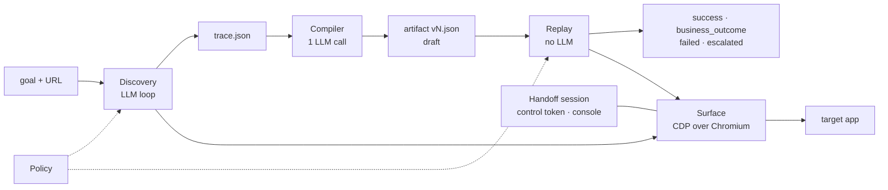
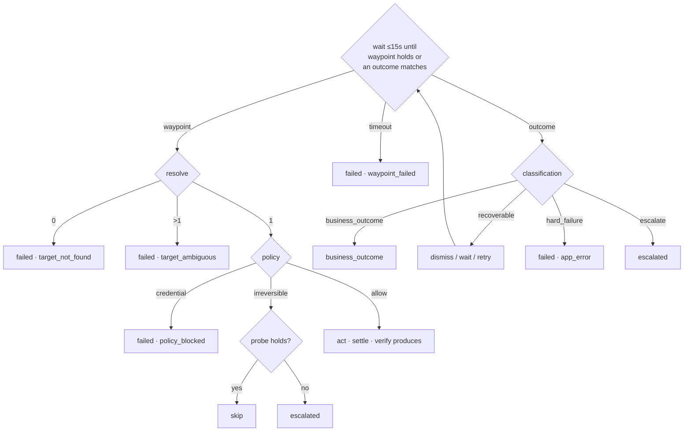
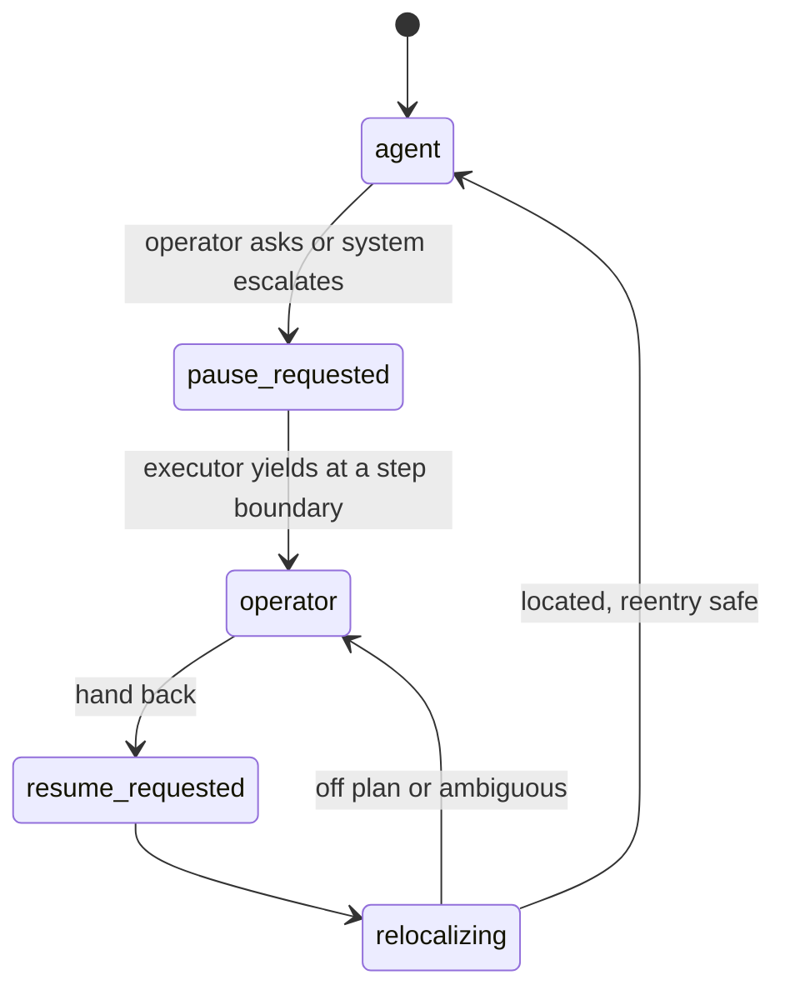
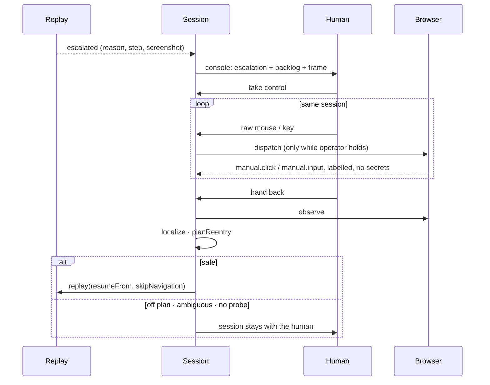

# Design Report

Design write up for the computer use automation take home. `README.md` has setup and the demo path. `evidence/README.md` indexes the recorded runs.

> **The model discovers. The artifact is the capability. Replay never calls the model.**
> Every decision below serves one of those three sentences.

## 1. Architecture

### 1.1 Overview



| choice | value | why |
|---|---|---|
| runtime | TypeScript, Node 20 | Zod gives one schema for validation, types and JSON Schema |
| browser | Playwright's Chromium, driven over CDP | accessibility tree, raw input and screencast are all CDP calls |
| model | Vercel AI Gateway, model id in `.env` | the model is only in discovery and compile, so portability wins |
| topology | one process | none of the hard problems change shape with more processes |
| target | bundled legacy app, MemberDesk 7.2 | only a local app can inject runtime faults reproducibly |

### 1.2 The one rule

`src/schema` (persisted) never imports `src/surface` (ephemeral).

A platform handle, CSS selector or pixel coordinate that reaches a saved artifact makes it non portable across surfaces and tenants. The rule is held by import direction.

### 1.3 Perception

* **How.** Every frame's accessibility tree over CDP, filtered to actionable and informational roles, normalised to a 19 value role vocabulary. Frames keyed by name, never index.
* **Why.** The only representation that exists on modern web, legacy web and desktop. An order of magnitude smaller than HTML, which matters because discovery resends the screen every step.
* **Rejected.** DOM selectors: absent on table layout apps, meaningless on desktop. Screenshot plus coordinates: a coordinate is not an identity. Kept only as a designed last tier.

### 1.4 Anchor enrichment

The lookup field on the target app is a `textbox` with an empty name. "Member ID" is the adjacent `<td>`.

* **How.** An in page function walks outward from every control (and every text or cell node, since outputs live there) and returns the first label found, with the relation:

| order | source | relation |
|---|---|---|
| 1 | `aria-label`, `title`, `placeholder` | `labelledBy` |
| 2 | `<label for>` or a wrapping label | `labelledBy` |
| 3 | previous cell in the same row | `inSameRowAs` |
| 4 | first cell of the previous row | `follows` |
| 5 | previous sibling with text | `precededBy` |

* **Why on named controls too.** Chrome synthesises `"Submit"` for an image input with no alt text. Trusting it pins the artifact to a browser default. Name and anchor are recorded together.

Two budgets fight on a real page, and both had to change. Anchoring is a prioritised second pass — anonymous controls first (the anchor *is* their identity), then cells, then named controls, then loose prose — because enrichment costs two CDP round trips per node. And the render budget no longer ranks all controls above all data: on the Bank of America article, ~2000 links consumed the 140 node cap before the first infobox cell, so the model could not see ISIN anywhere on screen and went looking for it in the **edit view of a live encyclopedia**. Controls and anchored data now each get a guaranteed share, and all 39 anchored infobox cells render.

### 1.5 Acting

* **How.** Scroll into view, box model centre, `Input.dispatchMouseEvent`. Typing is select all then `insertText`, so a prefilled field is overwritten, not appended to.
* **Why.** Real events exercise the app's own handlers, and the same primitive forwards an operator's input during a handoff.
* **Rejected.** `element.click()`. It bypasses handlers and adds a second locating mechanism beside the artifact's own.

### 1.6 Discovery loop

* Tools: `click`, `type`, `select`, `extract`, `finish`, `giveUp`. The model sees the rendered observation, never HTML.
* Stops on `finish`, `giveUp`, 20 steps, or 240 s wall clock.
* The tool set equals the step kinds an artifact can hold. That is what makes compilation mechanical.
* Three record time gates:
  1. every synthesised descriptor is resolved back against its observation; a miss marks the step `fragile`
  2. an output anchored to a number, a currency or its own value is rejected
  3. an irreversible action may not be repeated in one run (a ParaBank run once opened two accounts)
* **One action per step, enforced.** A model may emit several tool calls in one step and the SDK will run them all, back to back. For a chat tool that is throughput; for a UI it is incoherent — every action changes the screen, so the second call was chosen against a screen that no longer exists when it runs, and nothing re-perceives in between to notice. On weather.gov the model emitted `click("Go")` and `type("10001")` together; they executed 48 ms apart, pressing Go on an empty form. The submit did nothing, and the run spent four minutes and seven more Go clicks reasoning about a failure whose cause had already scrolled out of the context. The extra call is now refused rather than queued: the model is told why and handed a fresh observation. Same task, same model: eleven flailing steps became four, and the run succeeded in about fifty seconds.
* Cost: stale observations compacted before every call (74 percent fewer input characters on a sample run), reasoning effort `low`, 140 node cap.

### 1.7 Compilation

* Pass 1, one model call: which literals are parameters, which are fixed configuration. Validated against the trace; a parameter not present at its step is dropped with a warning.
* Pass 2, mechanical: steps, parameterised targets, waypoints, outputs, `mustMatchParam`, checkpoint, route pattern.
* Backtracking is pruned: when the walk returns to a screen, everything from that screen's first visit is dropped and listed in warnings.
* Output is `draft`, or `incomplete` with `--partial` when no checkpoint was reached.

### 1.8 Operator console

* Zero dependency HTTP in the runner process. Screencast out over server sent events, control and raw input back over POST.
* The session stays in the runner. That is the shape of attaching to a containerised session in production. The Electron app is a window around this page.

## 2. Artifact schema

An artifact is a contract for what can be invoked, not a recording of what happened.

```
CapabilityArtifact
  id, version, name, description
  app        { vendorProduct, recordedTenant, surfaceKind, entryPathPattern }
  inputs[]   { name, type, required, description, example, sensitive }
  outputs[]  { name, type, from: TargetDescriptor, transform, sensitive, mustMatchParam? }
  outcomes[] { name, classification, detect: StateAssertion, message, recovery?, verified }
  steps[]    { id, kind, target?, value?, waypoint?, produces?, effect, idempotencyProbe?, fragile? }
  checkpoint StateAssertion
  approval   incomplete | draft | approved
  provenance { recordedAt, discoveryRunId, model, goal, warnings[] }
```

| job | fields | reader |
|---|---|---|
| contract | `inputs`, `outputs`, `outcomes` | the calling agent |
| script | `steps`, `checkpoint` | the replay engine |
| safety | `effect`, `idempotencyProbe` | policy, reentry |
| reentry map | `waypoint` | relocalisation after a takeover |

### 2.1 TargetDescriptor

* role + optional name (with match mode) + optional anchor (relation, text) + frame name + optional ordinal + ranked fallbacks.
* Invariant: name or anchor is required. A bare role is rejected.
* `name` and `anchor.text` accept `{{param}}`. "Click the row for member {{memberId}}" is the pattern every results grid needs.
* Never a CSS selector, XPath or coordinate as the primary locator.

### 2.2 StateAssertion

* Kinds: `nodeExists`, `nodeAbsent`, `textPresent`, `locationMatches`, `all[]` one level deep.
* One vocabulary for the checkpoint, waypoints, idempotency probes and outcome detection.
* Why one: on the first run the model described its checkpoint with the same anchor relation it used for targets. A second vocabulary would have fought that.
* `locationMatches` tests every frame's URL. A frameset's top URL never changes.

### 2.3 Value sources

| `value.from` | meaning | stored |
|---|---|---|
| `param` | supplied by the caller per call | name only |
| `literal` | fixed configuration | yes |
| `operator` | typed by a human at run time | never; only the prompt |

`operator` is how a flow behind a login is expressible while the artifact holds nothing. Replay escalates on reaching it.

### 2.4 Outcomes live in the artifact

* Each capability declares its own: classification, detection, message, optional recovery (`dismiss`, `wait`, `retryStep`), `verified`.
* Why not in the engine: "not authorized" is an answer for a balance lookup and a fault for a batch job. The capability decides, reviewably.

### 2.5 Outputs

* Anchor only: the node's text is the payload, so it can never be the locator.
* `mustMatchParam` is set when an extracted value equalled an input on the recorded run. The checkpoint proves the right screen, not the right record. Input `40006` in the evidence fails with `output_mismatch` for exactly this reason.

### 2.6 Approval

| rung | meaning | invocable |
|---|---|---|
| `incomplete` | no checkpoint; success cannot be verified | no |
| `draft` | run once, by a model, on one tenant | attended only |
| `approved` | reviewed | unattended |

Schema refinements reject: a draft without a checkpoint, an irreversible step without a probe, an undeclared parameter, a literal that looks like a credential.

### 2.7 Storage

* One JSON file per version. Overwrite is refused. Loads are parsed, not cast.
* `load()` returns the highest **approved** version, else the highest. A v3 recorded on a cheaper model once clicked Search before typing and would have shadowed a working v2.
* Files, not a database: a v1 to v2 diff is what a reviewer wants, and git does it.
* Routes are canonicalised: `/detail?q1=12345&q2=M` is stored as `^/detail(\?|$)`.

## 3. Determinism & error handling

### 3.1 Replay, per step



After the last step: checkpoint loop (3 attempts, recoverable outcomes dismissed between them), then outputs, then `mustMatchParam`.

No model anywhere. `test/replay-purity.test.ts` walks the import graph from the engine and fails if a model SDK is reachable.

### 3.2 Resolution

| tier | matches on | note |
|---|---|---|
| 1 | accessible name, normalised | "Member ID:" equals "Member ID" |
| 2a | anchor text + recorded relation | the legacy case |
| 2b | anchor text, any relation | a label moved into a real `<label>` still resolves |
| 3 | recorded text fallback | logged; a step living here needs review |

* Pure function of `(observation, descriptor, params)`. Tested against fixtures with no browser.
* More than one match with no ordinal is `ambiguous`, never first match. First match is how the wrong member's row gets clicked.
* The matched tier is written to every step report as `resolvedVia`.

### 3.3 Waiting

* `waitForStable`: document complete, no navigation for 150 ms, no request in flight for 350 ms, 400 ms grace at the start because a CDP click returns before navigation begins.
* `waitUntil(predicate)`: observe every 250 ms, up to 15 s.
* Consequence: transient slowness needs no retry policy. The eight second stall reports plain `success` in 8.8 s. Waiting is the recovery.
* Rejected: Playwright auto waiting. Raw CDP input means Playwright never sees the click.

### 3.4 Result contract

| status | carries |
|---|---|
| `success` | outputs |
| `business_outcome` | outcome name, message |
| `failed` | code, step, expected, observed, screenshot |
| `escalated` | reason, step, location, screenshot |

Codes: `input_invalid`, `not_approved`, `waypoint_failed`, `target_not_found`, `target_ambiguous`, `checkpoint_failed`, `output_missing`, `output_mismatch`, `policy_blocked`, `app_error`.

Four variants, not one status field: a caller that handles only success and failure is forced by the types to notice `business_outcome`.

### 3.5 Outcomes are learned, classifications are authored

* `learn-outcomes` runs the happy path, then each probe input with handling disabled, and diffs the text. The longest novel string is the signature. For an interstitial, the new link is the dismiss target.
* Wording drifts between tenants and versions, so it is learned. Whether "not authorized" is an answer or a fault cannot be learned, so it is declared.
* `verified` is true only because a run produced the state.

| input | condition | result |
|---|---|---|
| `99999` | no member | `business_outcome` |
| `40003` | permission denied | `business_outcome` |
| `40001` | 8 s stall | `success` |
| `40002` | interstitial | `success`, dismissed, checkpoint retested |
| `40004` | HTTP 500 | `failed · app_error` |
| `40005` | session expired | `escalated` |
| `40006` | wrong record | `failed · output_mismatch` |

### 3.6 Measured, not asserted

`--repeat N` reports distinct statuses, outputs and resolution paths. The third column is the early warning: a step alternating between name and anchor is a descriptor drifting under a healthy looking result.

Consistency is reported separately from working, because three identical failures are perfectly consistent. An earlier version printed `STABLE` for them and exited 0, which would have let a broken capability pass any CI gate built on `--repeat`.

### 3.7 Determinism is not generalisation

A capability that works only for the value it was recorded on is a recording, and repetition cannot tell the difference: the recorded case passes by construction, identically, every time. `--repeat` would call it STABLE and be right.

`npm run verify` replays a capability against values it has **never seen**, and `--approve` makes promotion conditional on that evidence:

```
$ npm run verify -- wikipedia.readCompanyInfobox \
    --case "companyName=Bank of America" --case "companyName=Toyota" --approve

  pass  recorded  {"isin":"US0605051046","industry":"Financial services",...}
  pass  unseen    {"isin":"JP3633400001","industry":"Automotive",...}

  GENERALISES — 1 of 2 cases used values it was never recorded against
  wikipedia.readCompanyInfobox v2 → approved, on 2 verified cases.
```

This is the rung that makes `approved` mean something stronger than `draft` rather than merely later, and it caught a real defect the day it was written. A weather.gov capability anchored its temperature to `precededBy "Overcast"` — the current conditions text, which is *data wearing the shape of a label*. The compiler could not know; it sees one trace. Verify ran it against a second ZIP and reported PINNED, because Beverly Hills was not overcast. Twenty four hours later New York read "Fair" and the capability failed on its own recorded ZIP as well.

It was never approved. The model produced it, the compiler accepted it, and the gate refused it — which is the ladder doing exactly what it is for. A single green replay on the day of recording would have shipped it.

The rule that falls out: **an anchor must be a label, not a value.** `inSameRowAs "ISIN"` holds because every company article has an ISIN row. `precededBy "Overcast"` holds until the weather changes.

### 3.8 UI drift

1. name and anchor both recorded
2. relation relaxed before failing
3. waypoints assert a node, not a URL (an operator signing back in at `/signin` landed on the lookup form at a URL replay had never seen)
4. `fragile` on unverified descriptors
5. `resolvedVia` on every step

## 4. Heterogeneity & multi-tenant

### 4.1 The seam

`Surface`: `observe`, `resolve`, `act`, `screenshot`, `navigate`, `startStream`, `stopStream`, `dispatchRawInput`.

Everything above it is written against this interface only. `UINode.ref` is valid for one observation; `handle` is opaque. Neither reaches an artifact. Every role has a counterpart in ARIA, macOS AX and Windows UIA.

### 4.2 Legacy web is the implemented case

| property | handling |
|---|---|
| framesets | frames by name; `locationMatches` checks every frame |
| tables, no `<label for>` | anchor enrichment; `inSameRowAs` is a primary tier |
| image inputs, no alt | synthesised name recorded beside the anchor; the anchor carries `harbor` |
| canvas, WebGL | nothing to perceive; fails, and says so |

Measured: works wherever a screen reader would (Wikipedia, Hacker News, ParaBank, a React SPA). Bot walls are detected before a model call is spent.

### 4.3 Desktop, designed and stubbed

`DesktopSurface` implements every method at its real signature and throws. Nothing above the seam changed to add it.

* Perception: `AXUIElement` or UIA walked into the same `UINode` shape.
* Anchoring: `inSameRowAs` becomes geometric adjacency. Win32 and Swing dialogs expose unlabelled edits whose only identity is the text to their left.
* Process: out of process driver over JSON RPC on stdio. This is why `Surface` is coarse and async.
* Visual tier: `fallbacks[].kind = "visual"` with OCR text and an anchor offset is reserved for Citrix and canvas. Not built.

### 4.4 Multitenant

Built:

* app binding stores vendor product and a route pattern; the origin comes in per call (`--url`)
* routes are canonicalised; tenants differ in host and prefix, not route shape
* name and anchor together, relation relaxed, so markup changes replay unchanged

Not built: a tenant overlay for wording. `harbor` relabels "Member ID" as "Account Number" and the `meridian` artifact does not resolve there, because anchor text is matched strictly on purpose.

Designed: an overlay keyed by `(vendorProduct, tenant)` mapping step ids to replacement names or anchor texts, merged at load. Identity stays at the vendor level; each institution owns a small reviewable delta.

### 4.5 Drift signals

1. `resolvedVia` changes tier between runs
2. `--repeat` reports `FLAKY`
3. an outcome verified on another product version
4. a waypoint holding only through a fallback tier

Known class: the model relied on a dropdown default. A tenant with a different default would search by SSN. The compiler should assert implicit defaults as waypoints.

## 5. Escalation & handoff

### 5.1 Stuck

| path | trigger | result |
|---|---|---|
| discovery | `giveUp`, 20 steps, 240 s | run ends, trace kept |
| discovery | credential field, repeated irreversible action | refused; model told to `giveUp` |
| replay | outcome classified `escalate` | `escalated` |
| replay | `operator` value source | `escalated` |
| replay | irreversible step, probe does not hold | `escalated` |
| replay | waypoint or checkpoint never holds | `failed`, not escalated |

Escalation is for states a human can complete. A broken app is reported to the caller.

### 5.2 Control token



* No "both" state. Holder is `agent`, `operator`, or `nobody` mid transfer. Illegal transitions throw.
* While the agent holds, operator input raises a pause request; it never reaches the page. While the operator holds, the executor is blocked.
* Barge in lands at step boundaries. Waits are interruptible, actions are not, so every event has one actor.
* Found by use: a loop that stopped with a pause pending left the console on "handing over" forever. The session now yields automatically.

### 5.3 Handoff



* Same browser, no re login. Frames stream out; input is dispatched over CDP only while the operator holds the token.
* Human actions are captured semantically: a page listener reports click, input and submit with the nearest control's label, by the same cell walk perception uses. Password fields carry no value.
* Attribution is by token holder, because the agent's own events fire the same listeners.
* `--simulate` drives a scripted operator through the same gated path for reproducible evidence.

### 5.4 Relocalisation

> The plan is a map, not a program counter.

| observation | decision |
|---|---|
| checkpoint holds | completed; extract outputs |
| one waypoint holds | resume there, even backward |
| several hold, none irreversible | resume at the earliest |
| several hold, one irreversible | stop; cannot tell whether it ran |
| none hold | stop; automation does not guess |

For every irreversible step from the resume point: probe holds, skip; probe does not hold, operator decides; no probe, refuse. This is what prevents a second subaccount after the operator already submitted.

Discovery hand back has no relocalisation. There is no plan to be lost against; the model re observes and the interrupted tool call is explicitly not performed.

## 6. Safety

### 6.1 Policy

```
allowedOrigins        exact, no wildcards
allowedPathPrefixes   default ['/']
allowedActions        click type select press navigate read
irreversiblePatterns  submit confirm transfer delete approve open account create enroll ...
onIrreversible        block | require_approval | flag      default require_approval
sensitiveFieldPatterns password pin ssn card number account number dob ...
```

The entry URL is checked before the browser moves.

### 6.2 Classify once, enforce always

* Effect is proposed at compile time from the control's label and reviewed with the artifact.
* Replay enforces the declared effect and never reclassifies. Guessing whether a button is destructive mid run is where duplicates get posted.
* Typing is reversible; the submit commits. Creation is irreversible: an earlier list missed account opening and a run opened a second savings account.

### 6.3 Irreversible steps

1. discovery refuses to repeat one in a run
2. replay stops before it, saves a screenshot, returns `escalated`
3. reentry requires a probe

`require_approval` over `block`: a capability that can never submit is not useful. Over `flag`: a flag is read after the money has moved.

### 6.4 Credentials

* Refused, not redacted. Redacting after the value was typed into a live system is a consolation prize.
* Input type first (`password` is refused regardless of label), then label patterns. A label only check once let ParaBank's unlabelled login through and a password reached the trace.
* A refused field never enters the trace, so it can never enter an artifact. The schema also rejects a literal matching `^(pw|pass|pin|secret|token)`.
* Replay re checks the field itself. An artifact is a file, and a file can be edited.

### 6.5 Redaction

* Applied in `RunLog.append`, on the way in. Patterns: SSN, 13 to 19 digit card numbers, 9 to 17 digit account numbers, email.
* Sensitive inputs and outputs are `[REDACTED]` in `run.jsonl` and `result.json`. The caller gets real values; the evidence directory does not.
* `.env` is git ignored. Only discovery and compile read the key.

### 6.6 Limits

1. allowlist is origin and path, not per control
2. classification is label based; an unlabelled destructive control reads as reversible until review
3. redaction is heuristic and over broad: the compiler marked `memberId` sensitive, so evidence cannot show which member a run queried
4. screenshots are not redacted
5. the console has no authentication; localhost only

## 7. Cuts

| cut | seam in place | why |
|---|---|---|
| desktop driver | `DesktopSurface` stub | OS accessibility grant plus a second runtime; not expected by the brief |
| visual / OCR tier | `visual` fallback kind | only matters for canvas and Citrix |
| CSS / XPath fallbacks | accepted by the schema | surface specific; only `text` runs |
| tenant overlays | `harbor` tenant, `recordedTenant` | format designed in 4.4 |
| compiler authored probes and `produces` | schema requires probes; replay honours them | a trace with an irreversible step needs the probe added by hand before it parses |
| default state assertions | waypoint vocabulary | the dropdown drift class in 4.5 |
| assisted LLM fallback | escalation machinery | bounded, single step, published as a new draft |
| catalog endpoint | `toToolSchema()`, desktop catalog | no network surface for an external agent |
| screenshot redaction, console auth | | |

### 7.1 Known limits on real sites

These are measured, not suspected. Each is a real page the system handles badly.

| limit | what happens | why it is not a tuning problem |
|---|---|---|
| **Bot walls** | amazon.com returns 6 accessibility nodes — the CDN block page | nothing is rendered to perceive; `/dp/` is disallowed for automated clients. Not a perception bug and not fixable from inside the browser |
| **Values with no label** | weather.gov puts nothing label-shaped beside the temperature (`Current conditions at / STATION / Fair / 79°F`) | no anchor *choice* fixes it; the page has no label to anchor to. Caught by the gate (§3.7), never approved |
| **Definition-list layouts** | openlibrary.org yields 133 nodes and **zero** anchored | anchoring reaches for a table row or preceding text; a `<dl>` presents neither. Needs a third relation kind, not a bigger budget |
| **JSON in text nodes** | finance.yahoo.com anchored a control to `[{"fullExchangeName":"Nasd…` | embedded JSON is indistinguishable from prose to the AX tree; needs a shape filter on anchor candidates |
| **No prompt caching** | `cached=0` on every model call | the gateway is not reusing the prefix. Pure cost, no correctness impact, and the largest single saving still on the table |

The honest summary: this works on pages whose structure carries meaning — label/value rows, named controls, tables. It degrades on pages that are visually structured but semantically flat, and it does not work at all where a CDN decides it shouldn't.

Next, in order:

1. prompt prefix caching — the cheapest large win, and the one the token traces keep pointing at
2. a `describedBy` anchor relation for definition lists, which is the one structural gap with real sites behind it
3. tenant overlay plus default state assertions from the compiler
4. compiler generated idempotency probes: a `nodeExists` on the confirmation the recorded run saw after the step
5. bounded single step recovery on replay failure, gated by the existing draft rule
